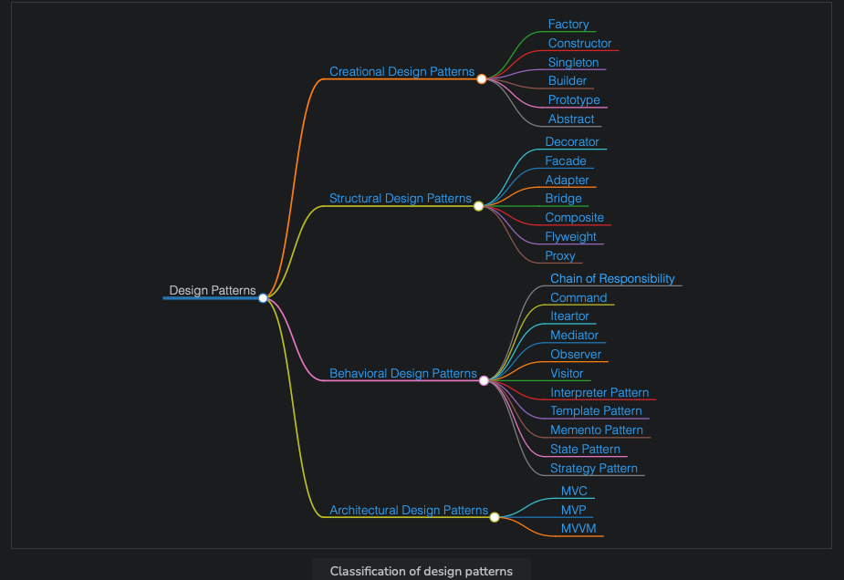

# What are Design Patterns?

Designing efficient and reusable code is something that all developers strive for. When working on large applications, code structure becomes an integral element where we need to prevent repeating code for similar tasks. However, trying to build upon and adding features to an existing system is quite a challenging task, since a developer needs to know the complete particulars. These include the relationships that each entity possesses or the sort of hierarchy that exists between different entities. Also, developers need to update their code in such a way as to make it easily adaptable to change in the future. In such scenarios, it’ll be helpful to have a structure that could be used to solve various common issues. This is where the design patterns come into play.

Design patterns are solutions to frequently occurring real-life problems in software design. They can also be considered customizable templates that can meet the requirements of a particular design problem. Let’s take the example of an ice-cream factory that serves as the base of operations to produce various types of ice creams according to the defined requirements. This is similar to how a design pattern can be used as a template in different circumstances.

## A Real-Life Example of Design Patterns

### Structure of Design Patterns

- **Pattern name:** This is an identification step that describes a design problem.
- **Intent:** This step describes the use case of the particular design pattern.
- **Motivation:** This step illustrates the problem and talks about the inner components in the pattern to solve the problem.
- **Structure:** This step visualizes the structure using a graphical representation of the classes in the pattern.
- **Consequences:** This step describes the trade-offs of a particular pattern.
- **Implementation:** This step illustrates an example of code in any popular programming language.

## Advantages of Design Patterns

The following are some of the advantages of using design patterns:

- They provide correct and efficient solutions since they have been derived and optimized by various experienced programmers over time.
- They are generic templates that can be modified and used for solving different problems.
- They can provide a clean and elegant solution to a large problem by avoiding repetition in the code.
- They provide a template on which the developers can build upon. This allows developers to spend less time on code structure and more on the overall quality of the solution.

## Consequences of Unfamiliarity with Design Patterns

While there are many advantages of using design patterns, it is important to fully understand the depths of design patterns, since unfamiliarity might cause the following issues:

- Design patterns can complicate the architecture of the application if they are managed poorly.
- Developers who are not familiar with them might end up getting confused as to why certain patterns are being used.

Now that we’ve gotten a flavor of what design patterns are, let’s explore some of their different types in the next lesson.

# Popular Design Patterns

The illustration below demonstrates some of the popular design patterns:

- MVVM
- MVP
- MVC
- Strategy Pattern
- State Pattern
- Memento Pattern
- Template Pattern
- Interpreter Pattern
- Visitor
- Observer
- Mediator
- Iterator
- Command
- Chain of Responsibility
- Proxy
- Flyweight
- Composite
- Bridge
- Adapter
- Facade
- Decorator
- Abstract
- Prototype
- Builder
- Singleton
- Constructor
- Factory

## Classification of Design Patterns

### Creational Design Patterns

These patterns are used to provide a mechanism for creating objects in a specific situation without revealing the creation method. The normal approach for creating an object might lead to complexities in the design of a project. These patterns allow flexibility in deciding which objects need to be created for a specific use case by providing control over the creation process.

### Structural Design Patterns

These patterns are concerned with class/object composition and relationships between objects. They let us add new functionalities to objects so that restructuring some parts of the system does not affect the rest. Hence, when some parts of the structure change, the entire system does not need to change.

### Behavioral Design Patterns

These patterns are concerned with communication between dissimilar objects in a system. They streamline communication and ensure that the information is synchronized between such objects.

### Architectural Design Patterns

These patterns are used for solving architectural problems within a given context in software architecture.

As discussed above, design patterns play a major role in the structuring of an application and are of great use to a developer. In the next few lessons, we will discuss the most common design patterns so that you can confidently answer any questions related to them in an interview and be able to implement them at your job.
