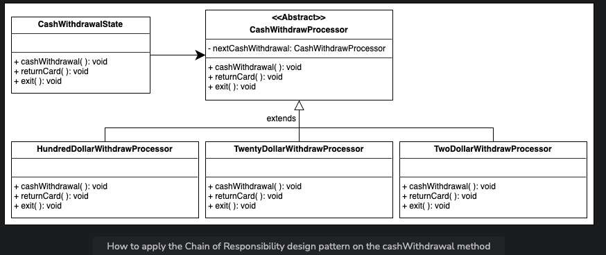

# Problem Definition: Automated Teller Machine (ATM)

An Automated Teller Machine (ATM) allows a bank customer to perform financial transactions remotely without the need for a teller or a bank branch. These transactions include deposits, withdrawals, balance inquiries, and account transfers. ATMs are located in convenient locations such as banks, grocery stores, airports, and other public places.

## Expectations from the Interviewee

### ATM Components
To better understand an ATM system, you may ask the interviewer the following questions:
- What are the components of an ATM?
- Is the ATM necessarily placed inside a room?
- Does an ATM have a fingerprint scanner?

### ATM Features
Different ATMs may vary in terms of features which is why it is important to clear the following questions from the interviewer:
- What is the withdrawal limit of an ATM?
- Can we check our account balance using an ATM?
- Can we set a PIN using an ATM?

### ATM Processing
The interviewer would expect you to ask a question regarding the processing of transactions using an ATM. Therefore, you may ask the following questions:
- What happens when the amount entered by the user for withdrawal is greater than the user's account balance?
- What happens when the amount entered by the user for withdrawal is greater than the ATM's cash limit?
- What happens when the amount entered by the user exceeds the total cash present in the ATM?
- Can the ATM be used for online transactions?

## Design Approach

We are going to design this ATM system using the bottom-up design approach. For this purpose, we will follow the steps below:
1. Identify and design the smallest components first—the screen, keypad, cash dispenser, printer, and card reader.
2. Use these small components to design bigger ATM components—the state, machine, and room.
3. Repeat the steps above until we design the whole ATM system.

## Design Patterns

It is always a good practice to discuss the design patterns under which the ATM system falls, during the interview. Stating the design patterns will give the interviewer a positive impression and shows that the interviewee is well-versed in the advanced concepts of object-oriented design.

The following design patterns are used to design the ATM system:
- The Singleton design pattern
- The State design pattern

# Requirement Collection

## R1: Single Account Access
Each user has a single account at the bank that they can access by inserting their card into the ATM.

## R2: Main Components of ATM System
The main components of the ATM system that facilitate interactions between the user and the machine are listed below:
- Card reader: To read the user's ATM card
- Keypad: To enter information such as the user's PIN
- Screen: To display messages to the user, such as prompts or error messages
- Cash dispenser: To dispense cash to the user
- Printer: To print receipts for the user
- Network infrastructure: To connect with the bank's computer system in order to access account information and complete transactions

## R3: User Authentication
The ATM system must authenticate the user based on the PIN they enter to ensure that only authorized users can access their accounts.

## R4: Transaction Authorization
All transactions are possible after the successful authentication of the ATM card.

## R5: Account Operations
The user can have two types of accounts—current and savings—and can perform the following operations on the ATM:
- Balance inquiry
- Cash withdrawal
- Funds/money transfer

## R6: Transaction Completion
At the end of a transaction, the user has the option to start another transaction or end their session.

# System

## Actors

### Primary Actors
- **Cardholder:** This actor inserts or removes the ATM card, performs or cancels transactions, and changes the PIN.

### Secondary Actors
- **Card issuer:** Verifies the cardholder's identity, checks for sufficient funds, account transaction limits, and blocks/unblocks the cardholder's account.
- **System:** Checks for sufficient funds in the ATM, ATM's transaction limit, and verifies the cardholder's identity. Also returns the card, dispenses amount and receipts.
- **Operator:** Responsible for starting and shutting down the system, refilling printer receipts, and cash dispensers.

## Use Cases

### Cardholder
- Insert card: To insert an ATM card into ATM
- Transaction: To perform operations—balance inquiry, deposit, fund transfer, or cash withdrawal
- Change PIN: To change the PIN of the ATM card
- Cancel transaction: To cancel a transaction

### Card issuer
- Verify cardholder's identity
- Check sufficient funds in account
- Check account transaction limits
- Block/Unblock account

### System
- Verify cardholder's identity
- Check sufficient funds in ATM
- Check ATM withdrawal limits
- Return card
- Dispense money
- Dispense receipt

### Operator
- System startup/shutdown
- Refill printer receipts
- Refill cash dispenser

## Relationships

### Generalization
- The “Transaction” use case generalizes “Balance Inquiry,” “Deposit,” “Transfer,” and “Cash withdrawal,” as a cardholder can use any of these options to perform a transaction.

### Associations
- **Cardholder:**
    - Change PIN
    - Insert card
    - Cancel transaction
    - Transaction

- **Card issuer:**
    - Check for sufficient funds in account
    - Verify cardholder's identity
    - Block/Unblock account
    - Check account transaction limits

- **System:**
    - Check sufficient funds in ATM
    - Return card
    - Dispense money
    - Dispense receipt
    - Verify cardholder's identity
    - Check ATM withdrawal limits

- **Operator:**
    - System startup/ shutdown
    - Refill printer receipts
    - Refill cash dispenser

### Extend
- The “Transaction” use case extends the “Dispense receipt” use case, as the option to get a receipt is available in transactions.

### Include
- When the cardholder inserts the card into the ATM, both the bank and card issuer verify the card and the cardholder's account. Therefore, the “Insert card” use case includes “Verify cardholder's identity.”
- When the cardholder performs a fund transfer, both the card issuer and the bank verify if the account has sufficient funds and if the amount is within transaction limits. Therefore, the “Transfer” use case includes “Check sufficient funds in account” and “Check account transaction limits.”
- When the cardholder withdraws cash from an ATM, verification of sufficient funds and transaction limits occurs at both the card issuer and the bank. Similarly, the ATM verifies sufficient funds and withdrawal limits. Therefore, the “Cash withdrawal” use case includes multiple verifications.
- When a transaction is performed or canceled, the ATM ejects the card. Therefore, both “Transaction” and “Cancel Transaction” use cases include “Return card.”

# Components of the ATM system

As mentioned earlier, we’ll design the class diagram for the ATM using a bottom-up approach.

## User
The `User` class represents a user with an ATM card and a bank account.

## ATM card
The `ATMCard` class is identified by the card number, customer name, expiration date, and the user's PIN.

## Bank account
`BankAccount` is a parent class with two types: `SavingAccount` and `CurrentAccount`. These classes are derived from the `BankAccount` class. This class stores the account number, total balance, and the user's available balance.
- `SavingAccount`: Represents a saving account with a withdrawal limit.
- `CurrentAccount`: Represents a current/checking account with a withdrawal limit.

- 
## Bank
The `Bank` class represents a bank with a name and a bank code. A bank may or may not have an ATM.

## Card reader, cash dispenser, keypad, screen, and printer
- **CardReader:** Accepts or rejects a card.
- **CashDispenser:** Provides the required amount specified by the user in cash.
- **Keypad:** Allows the user to enter the PIN.
- **Screen:** Displays information upon insertion of the card.
- **Printer:** Prints transaction/withdrawal receipts for the user.

- 
## ATM state
`ATMState` is an abstract class with six types: `CheckBalanaceState`, `CashWithdrawalState`, `TransferMoneyState`, `HasCardState`, `IdleState`, and `SelectOperationState`. These classes are derived from the `ATMState` class. This class decides the state of the ATM system and several states including the return card and exit of the ATM system.
- `CheckBalanceState`: Represents the state that allows users to check their account balance.
- `CashWithdrawalState`: Represents the state that allows users to withdraw cash.
- `TransferMoneyState`: Represents the state that allows users to transfer money.
- `HasCardState`: Represents the state that checks whether or not the user has a valid card and authenticates the card’s PIN.
- `IdleState`: Represents the state where the ATM system is idle and is not performing any functions.
- `SelectOperationState`: Represents the state that allows users to select an operation for the ATM to perform.

## ATM
An `ATM` class can either have an idle state or can be performing an operation. It has a limited number of hundred, twenty, and two-dollar bills.

## ATM room
An `ATMRoom` class has an ATM and may or may not have a user.

## Enumerations and custom data types
### ATMState
- Keeps track of the following states of an ATM:
    - Idle
    - Card inserted by the user
    - Option selected
    - Cash withdrawal
    - Transfer money
    - Display the account balance
### TransactionType
- Represents the following transactions:
    - Balance inquiry
    - Cash withdrawal
    - Funds/money transfer

## Relationship between the classes

### Association
- The `ATMRoom` class has a one-way association with `User` and `ATM`.
- The `User` class has a one-way association with `ATMCard` and `BankAccount`.
- The `ATMCard` class has a one-way association with `BankAccount`.
- The `ATM` class has a one-way association with `Bank` and `ATMState`.

### Composition
- The `ATM` class is composed of `Printer`, `Keypad`, `Screen`, `CardReader`, and `CashDispenser`.

- 
### Inheritance
- Both `SavingAccount` and `CurrentAccount` extend the `BankAccount` class.
- The `CheckBalanceState`, `CashWithdrawalState`, `TransferMoneyState`, `HasCardState`, `IdleState`, and `SelectOperationState` classes extend the abstract class, `ATMState`.

## Class diagram for the ATM System

Here’s the complete class diagram for our ATM design:

## Design pattern

The following design patterns have been used in the class diagram:
- The Singleton design pattern: Ensures the existence of a single instance of the ATM at a given moment that can be accessed by multiple users, due to the shared nature of the ATM components.
- The State design pattern: Enables the ATM to alter its behavior based on the internal changes in the machine. This way, an ATM can transition from one state to another, like switching from an idle state to displaying an account balance or money withdrawal state, and as soon as all the operations have been performed, it can switch back to the initial idle state.

## Additional requirements

There is a chance that the interviewer might ask about the working of the cash withdrawal process. How can it be implemented in our ATM system? This addition is a bit challenging since we need a system that can withdraw the correct combinations of hundred, twenty, and two-dollar bills, respectively, according to the amount specified by the user. The system also needs to work sequentially until the required amount is met.

We will use the Chain of Responsibility design pattern to tackle this addition to our system. This design pattern will ensure the correct division of the dollar bills in the ATM by creating a chain of handlers that forward the requests based on the situation until all the requirements are met.

We have created the following classes to implement the Chain of Responsibility design pattern:
- `CashWithdrawProcessor`: Associated with the `CashWithdrawalState` class. This abstract class is extended by `HundredDollarWithdrawProcessor`, `TwentyDollarWithdrawProcessor`, and `TwoDollarWithdrawProcessor`.
- `HundredDollarWithdrawProcessor`: Derived from `CashWithdrawProcessor` and is responsible for withdrawing hundred-dollar bills based on the requirement.
- `TwentyDollarWithdrawProcessor`: Derived from `CashWithdrawProcessor` and is responsible for withdrawing twenty-dollar bills based on the requirement.
- `TwoDollarWithdrawProcessor`: Derived from `CashWithdrawProcessor` and is responsible for withdrawing two-dollar bills based on the requirement.

**Valid Amount:** If the amount entered by the user has a modulus equal to zero with any of the specified bills that the ATM can withdraw, then the amount is considered valid for the transaction. If the amount is invalid, then the transaction will not be processed.

For example, a user wants to withdraw $548. The `HundredDollarWithdrawProcessor` class will start the cash withdrawal using the `cashWithdrawal()` method by taking out five bills of hundred dollars. Now that we have $48 to withdraw for the user which is less than a hundred dollars, the `TwentyDollarWithdrawProcessor` class will start withdrawing dollar bills. This class will take out two bills of twenty dollars with $8 remaining. Since two dollars is less than twenty, the `cashWithdrawal()` method of the `TwoDollarWithdrawProcessor` will take out four bills of $2 for the user. The withdrawal, in this case, is successful.
