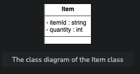
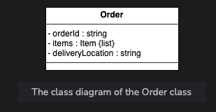
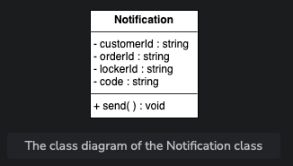
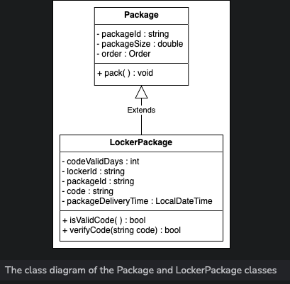
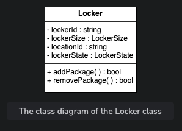
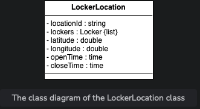
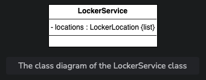
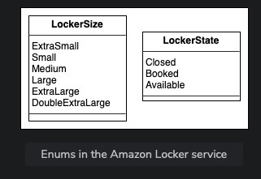
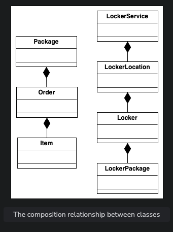
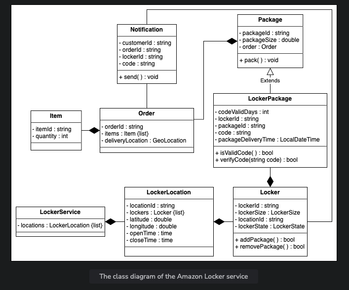

## Problem Definition

Amazon is an online retail platform that allows its customers to place orders and buy products online. There are times when the customer is not available in the particular location to pick up the order. In such a case, Amazon Locker can be one of the most secure ways of delivery.

**Amazon Locker** is also known as Amazon Hub or Amazon Hub Locker. It is a fully automated package delivery service provided by Amazon. Customers can choose any locker location as their delivery address and pick up the package from that location at no additional cost. In particular, when a customer places an order and chooses to get their item delivered to the locker service, the system suggests the nearest available locker based on preferences. The order is packaged and placed in the locker. The customer gets the notification containing the code to open the locker, and they can pick up the package using that code within a valid amount of time. This is how the Amazon Locker service functions.

This problem is applicable to any retailer who wants to deliver goods safely to their customers.

## Expectations from the Interviewee

The Amazon Locker service consists of multiple components. Each component has its functionality and constraints. The following section provides an overview of some of the main expectations that the interviewer will want to hear you discuss in more detail during the interview.

### Locker Size

Every locker is of a specific size in the Amazon Locker system. The interviewer expects you to ask questions listed below:

- Will every locker be of the same size?
- Is there any size restriction on an item that can be kept in the locker?

### Locker Selection

The most significant part of the Amazon Locker service is the selection of the locker. The system has to make sure that more than one customer should not be able to access a locker at a single time. The interviewer expects you to ask the questions listed below to identify how the system will work in such situations:

- How will the system make sure that multiple customers do not get the same locker?
- Will the customer choose the locker of his own choice, or will the system assign him a locker based on availability?
- Can a customer get two lockers for different orders at the same time?
- Will the system keep in mind the locker and package sizes while assigning the locker to the customer?

### Locker Status

Since this problem revolves around the locker, you may ask the questions listed below about the locker status:

- Is there any time constraint on the package that can be kept in the locker?
- What will happen if the customer does not come to pick up his package within the valid time period?

### Returning an Item

Similar to the order delivery process, the item can also be returned through the Amazon Locker service. Therefore, you may ask the questions listed below:

- Can the customer return an item through the Amazon Locker service?
- If yes, will they get the same locker from which they picked up the item?
- How will the locker be assigned to the customer while returning an item?

## Design Approach

We will design this Amazon Locker service using the bottom-up design approach. For this purpose, we will follow the steps below:

1. Identify and design the simple components first, like the locker and item.
2. Use these small components to design bigger components, such as the locker location and order that can be composed of multiple lockers and items, respectively.
3. Repeat the steps above until we design the whole system.

## Design Pattern

It is always a good practice to discuss the design patterns that the Amazon Locker service falls under, during the interview. Stating the design patterns will give the interviewer a positive impression and shows that the interviewee is well-versed in the advanced concepts of object-oriented design.

The following design patterns can be used to design the Amazon Locker service:

- Strategy design pattern
- Repository design pattern

## Requirement Collection

The requirements for the Amazon Locker service are defined below:

- **R1:** While ordering the item(s), the customer can choose the nearest location to pick up the order package from the locker.

- **R2:** One or more items can be contained in one order. An order will be placed in a package before the delivery.

- **R3:** There can be different sizes of lockers including extra small, small, medium, large, extra large, and double extra large.

- **R4:** The locker is assigned to the customer based on the size of the order package.

- **R5:** When the order package is delivered to the locker location specified by the customer, a 6-digit code will be sent to the customer to open the locker.

- **R6:** The package will be kept or placed inside the locker for three days only.

- **R7:** If the customer does not pick up the package from their locker within three days, the refund process will be initiated, and the customer won’t be allowed to pick up the package any longer.

- **R8:** Only eligible packages can be placed in the locker such that the size of the package must be less than the size of the locker.

- **R9:** There can be multiple lockers at every locker location.

- **R10:** The Amazon Locker is accessed within a specific time. Every location has its opening and closing time. Therefore, the customer should pick up the package during this time period.

- **R11:** The item can be returned to the Amazon Locker if it doesn’t match the expectation of the customer or is faulty, and there is a refund policy available for that product.

- **R12:** To return an item, the customer needs to choose the nearest locker location. An available locker will be assigned to them based on the size and location.

- **R13:** When the customer picks up the order package from the locker, the locker’s state is changed to closed, and the customer will no longer be able to open the locker with the given code.

# Components of an Amazon Locker service

In this section, we’ll define the classes for an Amazon Locker service. As mentioned earlier, we are following the bottom-up approach to design a class diagram for the Amazon Locker service.

## Item
The `Item` class represents each item of the order. Every item contains an Id and the order’s quantity. The class representation is shown below:

## Order
The order placed by a customer is represented by the `Order` class. Every order has a unique Id, contains a list of items, and the delivery location of the order. The UML representation of a class is shown below:

## Notification
The notification is sent to the customer when an order is shipped. A `Notification` class has a customerId, orderId, and lockerId that specify the customer to whom the notification has to be sent, against the order the notification has to be sent, and the locker where the order has arrived, respectively. Moreover, this class contains a 6-digit code to open the locker. The class definition is given below:

## Package and locker package
The `Package` class represents the order which is packaged. The package is what can be kept in the locker. Each package has its own id and size. Moreover, the Package class has an Order type attribute to show against which order the package is sent. The class representation of Package is provided below:

The package that is kept inside the locker is represented by the `LockerPackage` class. Since an item kept in a locker has a validity of certain days, we have codeValidDays to keep track of this. This class contains lockerId to keep track of which locker contains a particular package. The code to open the locker for that package is stored in the code class and the packageDeliverTime class stores information about when the package is delivered to the particular locker.

## Locker
Since we are designing a locker service problem, we should have a `Locker` class. Every locker has its ID, size, and reference to the location ID. Moreover, the `Locker` class has a member, lockerState, to specify the present state of the locker. We can add a package to the locker and remove a package from the locker. The UML representation of a class is shown below:

## Locker location
A locker is kept at the location. Since a location may contain more than one locker, we have a list of lockers in the `LockerLocation` class. The longitude and latitude are used to store the location. According to the requirements, the specific locker is opened only for a particular period of time and the customer can only get a package from the locker if they visit the locker during the location timing. The openTime and closeTime variables store information about the timings applicable to the particular locker location.The representation of this class is given below:

## Locker service
The `LockerService` class is the main class of the Amazon Locker service system and contains a reference to the list of locker locations. The UML representation of the class is given below:

## Enumerations
The list of enumerations required in the Amazon Locker service is provided below:

- `LockerStatus`: The locker status describes the current status of the locker, whether it is closed, booked, or available.
- `LockerSize`: The locker size expresses the size of the locker, whether it is extra small, small, medium, large, extra large, or double extra large.

## Relationship between the classes
Now, we’ll discuss the relationships between the classes in the Amazon Locker service.

### Association
The class diagram has the following association relationships:

- The `Notification` class has a two-way association with the `Locker` and `Order` classes.

### Composition
The class diagram has the following composition relationships:

- The `LockerService` class comprises the `LockerLocation` class, which itself is composed of the `Locker` class and the `LockerPackage` class.
- The `Package` class is composed of the `Order` class which is composed of the `Item` class.

### Inheritance
The following classes show an inheritance relationship:

- The `LockerPackage` class extends the `Package` class.

## Class diagram of the Amazon Locker service
Here’s the complete class diagram for our Amazon Locker service:

## Design pattern
In the Amazon Locker service, there are multiple lockers at the given locker location. There are also different locker locations which are specified by the customer. Therefore, the system assigns the most appropriate locker to the customer by considering the customer’s location, and locker size. Therefore, the Strategy design pattern can be applied here. Other than that, our system can also have the following strategies:

- OTP generation
- Random number generation
- Locker assignment
- Locker filtration

We can also use the Repository design pattern for the Amazon Locker system, where we can make the following repositories:

- Locker repository
- Package repository
