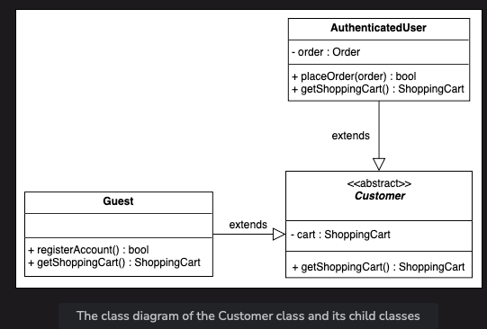
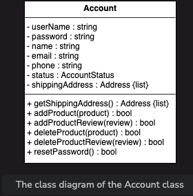

# Amazon Online Shopping System Overview

Amazon is an online retail platform that facilitates buying and selling products between users. Users can explore numerous product categories, each with reviews and ratings to aid in decision-making. Customers can add desired items to their shopping carts for easy ordering and checkout. The system supports various payment methods, and users receive notifications regarding order and shipment statuses. Additionally, users can also list products for sale.

## Expectations from the Interviewee

During the interview, the interviewer will likely focus on specific aspects of the Amazon online shopping system. Some key points for discussion include:

### Discoverability

- How buyers discover products within the platform.
- Methods employed for search result surfacing.

### Cart and Checkout

- Adherence to best practices in cart and checkout design.
- Innovative checkout features like "one-click purchase."

### Payment Methods

- Accepted payment methods such as credit cards, gift cards, etc.
- Integration of payment methods with the checkout process.

### Product Reviews and Ratings

- Criteria for posting reviews and ratings.
- Mechanisms for prioritizing useful reviews and deprioritizing less useful ones.

## Design Approach

The design of the online shopping system will follow a bottom-up approach, consisting of the following steps:

1. Identify and design small components (e.g., individual products).
2. Utilize these components to design larger entities (e.g., product categories).
3. Repeat the process to design the entire system, encompassing multiple categories and user interactions.

## Design Patterns

Discussing design patterns during the interview demonstrates familiarity with advanced object-oriented concepts. The Amazon online shopping system can be designed using the following patterns:

- Factory Design Pattern
- Strategy Design Pattern

Requirement collection
The requirements for the Amazon online shopping system design problem are defined below:

R1: A customer can either be an authenticated user or a guest. The authenticated user is one with a registered account on the Amazon online shopping system, whereas a guest does not have a registered account.

R2: An authenticated user should be able to buy, sell, and search the products via the product name or category. A guest is only able to search for products.

R3: A product can have multiple reviews and ratings from multiple customers.

R4: An authenticated user should be able to add, remove, or modify product items in their shopping cart. The authenticated user can further check out and buy the items.

R5: The authenticated user should be able to specify a shipping address at the time of order.

R6: Payment can be made through credit cards, electronic bank transfers, or through cash on delivery.

R7: An order can be canceled, only in the case that it hasn’t been shipped.

R8: Notifications are sent whenever there is a change in the order or shipping status.

R9: Shipment can be tracked to see the current status and the estimated time of arrival for the order.

R10: An admin should exist that can add, modify, or remove product categories and block users.

# Amazon Shopping System

## Actors

### Primary Actors

- **Authenticated User**: Can search for products, place or cancel orders, and add new products to sell.
- **Guest**: Can search for products, add items to a shopping cart, and update it. Needs to become a registered member to place an order.

### Secondary Actors

- **Admin**: Can manage accounts and product categories.
- **System**: Responsible for sending notifications for orders and shipping updates.

## Use Cases

### Admin

- Login/Logout
- Block/Unblock/Update/Delete account
- Add/Modify/Delete product category
- Modify product

### Authenticated User

- Register account
- Login/Logout
- Update/Delete account
- Add/Modify/Delete product
- Search product
- Add item to shopping cart
- Update shopping cart
- Checkout shopping cart
- Add shipping address
- Add credit card

### Guest

- Register account
- Search product
- Add item to shopping cart
- Update shopping cart

### System

- Send order notification
- Send shipment update notification

## Relationships

### Generalization

- **Authenticated User** generalizes **Guest**.
- **Search product** generalizes **By product category catalog** and **By product name catalog**.

### Associations

| Actor             | Use Cases                        |
|-------------------|----------------------------------|
| Admin             | Login/Logout, Update/Delete account, Add/Modify product category, Modify product |
| Authenticated User| Register account, Login/Logout, Update/Delete account, Search product, Add item to shopping cart, Add/Modify product, Update shopping cart, Checkout shopping cart, Add shipping address, Add credit card |
| Guest             | Register account, Search product, Add item to shopping cart, Update shopping cart |
| System            | Send order notification, Send shipment update notification |

### Include

- **Add product** and **Modify product** include **Update catalog**.
- **Make payment** includes **Send order notification**.
- **Cancel order** includes **Refund payment**.

# Components of Amazon Online Shopping System

## Customer
The `Customer` abstract class represents users attempting to buy products from Amazon. It includes access to the shopping cart through the `getShoppingCart()` function.

### Authenticated User
- Refers to a registered user on Amazon.

### Guest
- Refers to a user without an account, who can browse and add items to the cart but needs to register to place an order.

## Admin
The `Admin` class refers to a registered user who can manage product categories and user accounts.

## Account
The `Account` class manages personal details of authenticated users and admins, including multiple shipping addresses and product reviews.

## Product
The `Product` class contains details of products available on Amazon, categorized and with optional reviews.

## Product Category
The `ProductCategory` class stores categories of products and their descriptions.

## Product Review
The `ProductReview` class includes ratings and reviews added by registered users for products.

## Catalog
The `Catalog` class lists products by name or category.

## Search
The `Search` interface defines functionalities for product searching.

## Cart Item
The `CartItem` class represents items in the shopping cart, with price and quantity attributes.

## Shopping Cart
The `ShoppingCart` class contains a list of cart items and enables cart management.

## Order
The `Order` class tracks customer orders, including status and payment details.

## Order Log
The `OrderLog` class records order history with creation date and status.

## Shipment
The `Shipment` class tracks shipment details, including dates and methods.

## Shipment Log
The `ShipmentLog` class logs shipment history with creation date and status.

## Payment
The `Payment` class handles various payment methods, including credit cards, electronic bank transfers, and cash.

## Notification
The `Notification` class sends order and shipment notifications through email or SMS.

## Enumerations
- AccountStatus: Indicates user account status (active, inactive, blocked).
- PaymentStatus: Indicates payment status (confirmed, declined, pending, refunded).
- OrderStatus: Describes order status (unshipped, pending, shipped, confirmed, canceled).
- ShipmentStatus: Indicates shipment status (pending, shipped, delivered, on hold).

## Custom Data Type
The `Address` custom data type stores customer locations.

## Relationships
### Association
- Guest class with Search.
- Notification class with ShipmentLog and OrderLog.
- Product class with Account, CartItem, ProductCategory, and ProductReview.
- ShoppingCart class with CartItem.
- Order class with Payment and ShoppingCart.

### Composition
- Shipment class composed of ShipmentLog.
- Account class composed of CreditCard, ElectronicBankTransfer, Admin, and AuthenticatedUser.
- AuthenticatedUser class composed of Order, which itself is composed of OrderLog.
- Customer class composed of ShoppingCart.

### Aggregation
- Product class contains Catalog.

### Generalization
- Catalog class implements Search.

### Inheritance
- Guest and AuthenticatedUser extend Customer.
- EmailNotification and SMSNotification extend Notification.
- Cash, ElectronicBankTransfer, and CreditCard extend Payment.

## Class Diagram

## Design Pattern
In the Amazon online shopping system, Factory design pattern can manage different orders and bill generation based on customer selections. Strategy design pattern can calculate prices effectively for various discount types.

## Additional Requirements
- Wish List functionality for authenticated users.
- Discounts applied based on special events, managed by the Discount class.

