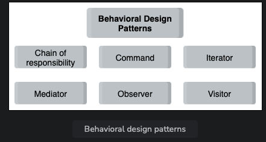

# What are Behavioral Patterns?

These patterns ensure effective communication between different objects in a system, assign responsibilities to them, and make sure they all have synchronized information.

## Behavioral Design Patterns

- **Chain of Responsibility Pattern**:
  Allows a request sent by a client to be received by more than one object. It creates a chain of loosely-coupled objects that, upon receiving the request, either handle it or pass it to the next handler object. A common example of this pattern is event bubbling in DOM.

- **Command Pattern**:
  Allows encapsulation of requests or operations into separate objects, decoupling the objects that send requests from those responsible for executing them. It helps in scenarios where the implementation of an API changes, reducing the need for changes throughout the application.

- **Iterator Pattern**:
  Allows the definition of various types of iterators for sequentially iterating a collection of objects without exposing the underlying form. It encapsulates how traversal occurs in an iteration, enabling efficient traversal of collections.

- **Mediator Pattern**:
  Allows a mediator (a central authority) to act as the coordinator between different objects instead of the objects referring to each other directly. It enables loose coupling of objects and centralizes communication between them, improving code readability and maintainability.

- **Observer Pattern**:
  Allows objects (observers) subscribed to an event to wait for input and react to it when notified, eliminating the need for continuous checking. It maintains a list of observers, notifying them when the event occurs, thus improving communication between different parts of the application.

- **Visitor Pattern**:
  Allows the definition of new operations to a collection of objects without changing the structure of the objects themselves. It separates the class from the logic it implements, enabling future extensions and modifications without altering the existing structure.

## When to Use Behavioral Design Patterns

| Behavioral Design Pattern | When to Use |
|---------------------------|-------------|
| Chain of Responsibility | - Handling various requests in different ways without knowing the sequence and type of requests beforehand. - Event bubbling in the DOM. |
| Command | - Queueing and executing requests at different times. - Performing operations such as "reset" or "undo". - Keeping a history of requests made. |
| Iterator | - Explicitly related to iteration problems, designing flexible looping constructs, and accessing elements from a complex collection without knowing the underlying representation. - Implementing a generic iterator that traverses any collection independently of its type efficiently. |
| Mediator | - Avoiding tight coupling of objects in a system with many objects. - Improving code readability and maintainability. - Making code easier to maintain. |
| Observer | - Breaking down large applications into a system of loosely-coupled objects. - Improving communication between different parts of the application. - Creating a one-to-many dependency between objects that are loosely coupled. |
| Visitor | - Performing similar operations on different objects of a data structure. - Performing specific operations on different objects in the data structure. - Adding extensibility to libraries or frameworks. |
