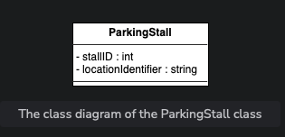

# Car Rental System

A car rental system is an application that manages the renting of automobiles for a short period of time—a few hours to a few weeks. A car rental system has a number of offices in different locations within each city. It allows the users to reserve and return a vehicle from different locations and is primarily located near airports or city areas. The car rental system keeps a list of all its clients in a database. The database includes the name, address, and contact number of each new customer. A member can reserve a car for a certain number of days, hire a car, or return the car that was rented. A member makes a reservation by supplying the pickup and drop-off locations, the kind of vehicle, and the day and time of the reservation.

## Application of the Car Rental System

Expectations from the interviewee
The car rental system consists of multiple components. Each component has its own functionality and constraints. This section provides an overview of some of the main expectations that the interviewer will want to hear you discuss in more detail during the interview.

### Vehicle Types

An interviewer would expect you to discuss the different vehicle types, and ask the following questions:

- What types of vehicles will that system support?
- How can we identify the specific vehicle?

### Search Interface

Members will use the application and add location and the reservation date. They will receive several options to select the vehicle. Therefore, an interviewer would expect you to ask questions listed below:

- Is it possible to search a vehicle using its name or type?
- Can we search for a vehicle by its model number?

### Services

An interviewer would also expect you to discuss the services of the car rental system and may ask the following questions:

- Does a car rental system assign a driver to its customer?
- Does a car rental system provide roadside assistance to its customer?

### Reservation Cancellation

There will be many duplicate instances in our system. The interviewer expects you to ask questions listed below:

- Can the member be able to cancel a reservation?
- Which member is allowed to request a vehicle reservation cancellation and when?

### Payment Flexibility

One of the car rental system’s most significant attributes is its customer payment structure. The payment depends on the vehicle type and time stamp. Therefore, an interviewer would expect you to ask questions listed below:

- How can customers pay at different branch locations and by different methods (cash, credit, or cheque)?
- If there are multiple branches of the car rental system, how will the system keep track of the customer having already paid at a particular branch?

## Design Approach

We’ll design this car rental system using the bottom-up design approach. For this purpose, we will follow the steps below:

1. Identify and design the smallest components, such as a vehicle, vehicle reservation, vehicle log, etc.
2. Use these small components to design bigger components, such as building a car rental system that can be composed of multiple vehicles.
3. Repeat the steps above until we design the whole system.

## Design Pattern

It is always a good practice to discuss the design patterns that a car rental system falls under, during the interview. Stating the design patterns will give the interviewer a positive impression and shows that the interviewee is well-versed in the advanced concepts of object-oriented design.

The following design pattern can be used to design the car rental system:

- Decorator design pattern

# Requirement Collection

The set of requirements for the car rental system are listed below:

- **R1:** There can be two types of users in the car rental system, i.e., customers and receptionists.

- **R2:** The system should handle multiple types of vehicles. Initially, the system should cater to the following vehicles: cars, trucks, vans, and motorcycles.

- **R3:** There can be multiple subtypes for vehicles.
    - The car type can be economy, luxury, standard, and compact.
    - The van type can be passenger or cargo.
    - Moreover, the motorcycle type can be cruiser, touring, or sports.
    - The truck type can be light, medium, or high-duty.

- **R4:** The system should be able to keep a record of who reserved a particular vehicle and on which date the vehicle was issued.

- **R5:** The system should be able to find out how many vehicles have been rented out by the specific customer.

- **R6:** The customers should be able to cancel their reservations.

- **R7:** To keep track of all events related to the vehicle, the system should maintain a vehicle log.

- **R8:** The system should allow the users to add equipment to the reservations like a ski rack, child seat, and navigation.

- **R9:** The system should allow the users to add services to the reservations like a driver, Wi-Fi, and roadside assistance.

- **R10:** The system should send a notification to the customer and generate a fine if the vehicle is not returned within the due date.

- **R11:** The system should allow the user to search the vehicles by type or model.

- **R12:** A system should be able to manage the multiple branches of the car rental system.

- **R13:** Every branch of the car rental system should have parking stalls to park the vehicles.

# Components of a Car Rental System

As mentioned earlier, we’ll design the car rental system using a bottom-up approach.

## Address and Person

The `Address` is a custom data type that is required to store any address. The `Address` contains attributes like a street address, city, state, etc. In the car rental system, this class will be used to specify the address of any person or a car rental location or branch. The `Person` class stores information related to a person like a name, email, phone number, and address. In the `Person` class, there is an object of the `Address` type to specify the person’s address. The class representation of `Address` and `Person` is given below:

## Account

`Account` is an abstract class that is used to store the account information of a person. This class has members like account ID, password, the status of an account, etc. There can be two types of accounts, i.e., customer and receptionist. The `Customer` class represents the customers who reserve the vehicle for themselves, while the `Receptionist` class represents the receptionist in the car rental system. Both of them can create any vehicle reservation and can cancel the reservation as well. The class representation of `Account` and its subclasses is given below:

## Driver

Since we are designing the car rental problem, we will have a `Driver` class. A customer can request an additional driver at the time of reservation. The class diagram is shown below:

## Vehicle

Our car rental system should have a vehicle object according to the requirements. The vehicle can be of four types: a car, truck, van, and motorcycle. For this purpose, we’ll create `Vehicle` as an abstract class and `Car`, `Truck`, `Van`, and `Motorcycle` as its subclasses, as shown in the figure below:

## Equipment

`Equipment` is an abstract class that stores information about different types of equipment that can be added to the reservation. For simplicity, we’ll assume three types of equipment, i.e., navigation, child seat, and ski rack. The class diagram for `Equipment` and its subclasses is as follows:

## Service

`Service` is an abstract class that represents the services provided to the customers along with the vehicle. While reserving a vehicle, the customers can add a service to their reservation. Every service has its fixed cost. We have three types of services, i.e., driver, roadside assistance, and Wi-Fi. The UML diagram of `Service`, along with its subclasses `DriverService`, `RoadsideAssistance`, and `Wi-Fi`, is given below:

## Notification

`Notification` is an abstract class responsible for sending notifications to customers. Every notification has an ID, creation date, and content in it. The notification can either be an SMS notification or an email notification. The `SMSNotification` class requires the phone number of the customer to send a notification, while `EmailNotification` is sent to the email address of the customer. The relationship diagram of these classes is shown below:

## Parking Stall

Each car rental location has parking stalls where the vehicles are parked. Each parking stall is identified by its ID and its location is specified by a location identifier. The representation of the `ParkingStall` class is shown below:

## Vehicle Log

`VehicleLog` is a class that is used to keep track of all the events related to a vehicle. Every vehicle log has its ID, log type, description, and creation date, as shown here:

## Vehicle Reservation

`VehicleReservation` is one of the most important requirements of the car rental system. To fulfill this functionality, we have a `VehicleReservation` class. This class is responsible for managing the vehicle reservation status of vehicles. The customer can add any equipment or service at the time of reservation as well. The UML representation of the class is shown below:

## Payment

The `Payment` class will be an abstract class and will have two child classes: `CreditCard` and `Cash`. These represent the two payment methods in the car rental system. The representation of these classes is given below:

## Fine

The system needs the `Fine` class to calculate the fine on the vehicle reservation in case the customer returns the vehicle after the due date, the fuel in the vehicle is less than the limit value, or there is any damage to the vehicle. The representation of this class is given below:

## Search Interface and Vehicle Inventory Class

`Search` is one of the most important functionalities of the system. It is the interface that allows the user to search for any vehicle and return the list of vehicles upon searching by any of the following methods:

- Search car by its type
- Search car by its model

The `VehicleCatalog` is a class where the search function is implemented. In each catalog, the vehicles are sorted according to one of the given search techniques, i.e., either the vehicle type or model. The following UML diagram shows this relationship:

## Car Rental System and Branch

`CarRentalSystem` is the main class of the car rental system and is the central part of the design. There can be multiple branches and locations of the car rental system. The `CarRentalBranch` class will represent each of these branches. The class representation is as follows:

## Enumerations

The list of enumerations required in the car rental system is provided below:

- VehicleStatus
- AccountStatus
- ReservationStatus
- PaymentStatus
- VanType
- CarType
- MotorcycleType
- TruckType
- VehicleLogType

These enumerations can be represented using the following class diagram:

## Relationship between the Classes

### Association

**One-way association:**

- Both the `Account` and `VehicleReservation` classes have a one-way association with the `Vehicle` class.
- The `Fine` class has a one-way association with `Payment`.
- 

## Two-way association

- The `VehicleReservation` class demonstrates a two-way association with `Payment` and `Notification`.

## Composition

The class diagram displays the following composition relationships:

- The `CarRentalBranch` class is composed of the `ParkingStall` class.
- The `Vehicle` class is composed of the `VehicleLog` class.

## Aggregation

Several classes exhibit an aggregation relationship:

- The `CarRentalSystem` class contains the `CarRentalBranch` class.
- Both the `ParkingStall` and `VehicleCatalog` classes consist of the `Vehicle` class.
- The `VehicleReservation` class has an aggregation relationship with the `Equipment` and `Service` classes.

## Inheritance

The class diagram demonstrates inheritance relationships:

- Both the `Receptionist` and `Customer` classes extend the `Account` class, while `Account` and `Driver` extend the `Person` class.

# Class Diagram of the Car Rental System

Here's the class diagram illustrating the components of the car rental system:

![Class diagram of the car rental system]

# Design Pattern: Decorator

The Decorator design pattern is employed in our car rental system with the following decorators:

- **Discount decorator**: Applies discounts to all vehicle types.
- **Peak season decorator**: Increases fares during peak seasons.
- **Damage fine decorator**: Calculates fines for vehicle damage upon return.
- **Partially filled fuel tank fine decorator**: Calculates fines for partially filled fuel tanks upon return.

These decorators adhere to the Single Responsibility Principle (SRP) and Open/Closed Principle (OCP).

# Additional Requirements

Additional requirements, such as a Barcode Scanner functionality, may be introduced. Each vehicle should have a unique barcode for identification.

