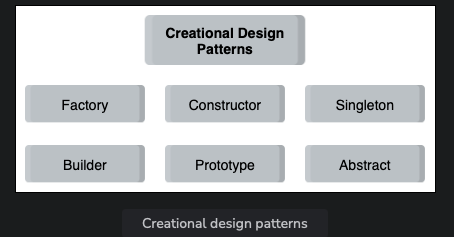

# Introduction to Creational Design Patterns

In this lesson, we will discuss creational design patterns. Creational design patterns deal with object creation mechanisms. As the name implies, these patterns provide optimized object creation techniques. They help cater to the design and complexity problems that might occur when using the basic approach. They also help control the creation of objects.

## Creational Design Patterns

- **Factory Pattern**:
  The Factory pattern is a creational pattern that provides a template that can be used to create objects. It is used in complex situations where the type of the object required varies and needs to be specified in each case. It does not use the new keyword directly to instantiate objects. Instead, it provides a generic interface that delegates the object creation responsibility to the corresponding subclass.

- **Constructor Pattern**:
  The Constructor pattern, as the name defines, is a class-based pattern that uses the constructors present in the class to create specific types of objects.

- **Singleton Pattern**:
  The Singleton pattern restricts the instantiation of a class to a single object. This allows the class to create its instance the first time it is instantiated, and on the next try, the existing instance of the class is returned. No new instance is created.

- **Builder Pattern**:
  The Builder pattern helps in building complex objects using simpler objects. It provides a flexible and step-by-step approach towards making these objects and shields the representation and process of creation.

- **Prototype Pattern**:
  The Prototype pattern is used to instantiate objects with some default values using an existing object. It clones the object and provides the existing properties to the cloned object using prototypal inheritance.

- **Abstract Pattern**:
  The Abstract pattern provides a constructor to create families of related objects. It is abstract, meaning that it does not specify concrete classes or constructors.

## When to Use Creational Design Patterns

| Design Pattern     | When to Use                                                                                                             |
|--------------------|-------------------------------------------------------------------------------------------------------------------------|
| Factory Pattern    | - When the type of objects required cannot be anticipated beforehand. - When multiple objects with similar characteristics need to be created. - When generalizing the object instantiation process, especially for complex setups. |
| Constructor Pattern| - When you need to create multiple instances of the same template, sharing methods but being different. - Useful in Libraries and Plugins design.                                    |
| Singleton Pattern  | - When a single object needs to coordinate actions across a system. - For services storing state, configuration, and providing resource access. - For database connections, configurations, etc.|
| Builder Pattern    | - When building apps that require creating complex objects, to hide the construction process. - For building complex DOM structures or similar scenarios.                                         |
| Prototype Pattern  | - To eliminate the overhead of initializing an object. - When the system should be independent of how products are created. - For creating objects from a database with values copied to the cloned object. |
| Abstract Pattern   | - Applications requiring object reuse or sharing. - Applications with complex logic involving multiple families of related objects. - For object caching and shielding object creation process from the client.   |
