# Elevator System Design

In this lesson, we’ll identify and design the classes, abstract classes, and interfaces based on the requirements that we have previously gathered from the interviewer in our elevator system.

## Components of an elevator system

As mentioned earlier, we should design the elevator system using a bottom-up approach. Therefore, we will first identify and design classes of the smaller components like button, door, and floor. Then, we will create the class of the entire elevator control system, which will contain these smaller components.

### Button

Button is an abstract class. There can be two types of buttons i.e., the elevator button and the hall button. The status of the button determines whether the button is pressed or unpressed. We can press the button or check the status of the button through the Button class.

The ElevatorButton subclass is inherited from the Button class and represents the buttons that are inside the elevator. When the elevator button is pressed, it specifies what would be the destination floor of the elevator car or where the passenger wants to go.

Similar to ElevatorButton, HallButton is also a subclass of the Button class. This class represents the buttons that are outside the elevator. This class used the enumeration Direction to specify whether the button is for going up or down. The hall button has two important pieces of information, the floor from where the button is pressed and the direction in which the passenger wants to move.

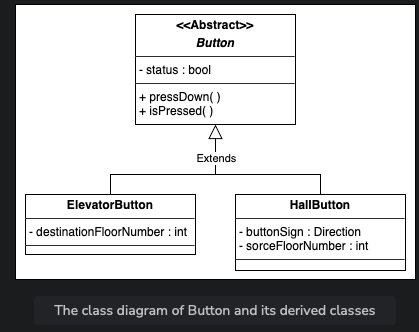

### Elevator panel and hall panel

ElevatorPanel is a class which is used to represent the complete grid of buttons inside the elevator. In the elevator panel, we will have a list of buttons for selecting the destination floor of the elevator and two buttons for closing and opening the elevator.

While the HallPanel class represents the buttons that are outside the elevators. The hall panel consists of only two buttons: up and down.

Both the elevator panel and the hall panel are used to take input from the passenger.

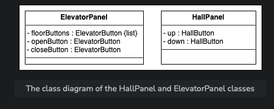

Number of buttons in the elevator panel = Number of floors + 2

Number of buttons in the hall panel = 2

### Display

Every elevator has a display to represent the current floor number and direction (up or down) of an elevator. It also gives information about the capacity of the elevator. So we will use the Display class which represents this information. The Display class consists of floor number, capacity, and direction. It has separate methods for both elevator display and hall display. The showHallDisplay() will present only the current floor the lift is in and the direction of the lift while the showElevatorDisplay() will display all of the class attributes. The class representation is provided below:

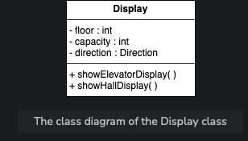

### Door

The Door class symbolizes the door of an elevator. This class has a reference to enum DoorState which depicts that the status of the door can be either open or closed. A simple representation of the Door class is provided below:

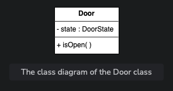

### Elevator car

ElevatorCar is the class that expresses the elevators of the building. Each elevator has a unique ID. This class consists of an enumeration named state that tells the present state of the elevator. Moreover, in every elevator car, there is a door, an elevator panel, and a display. The elevator car can start moving or stop on any floor. The UML expression of the class is as follows:

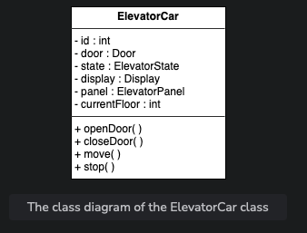

### Floor

The Floor class represents the floors of a building. Each floor consists of a number/list of hall panels to call the lift and has displays to indicate the current floor and direction of the lift since there is a separate panel and display for each elevator. Moreover, we will have isBottomMost() and isTopMost() functions to check if the floor is at the bottom or top, respectively. The down button will be disabled if the floor is at the lowest of the building and the up button will be disabled if the floor is topmost. The model of the Floor class is shown below:

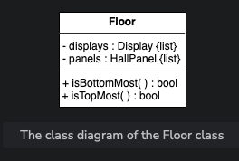

### Building

The Building class represents an actual building that consists of the number of floors and elevators. This class is represented below:

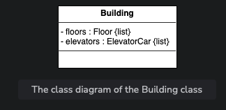

### Elevator system

ElevatorSystem is the main functional class of the whole elevator control system. The elevator system has a display of each elevator and monitors the elevator cars. The elevator system has a dispatcher to select the best elevator car. Moreover, the system takes control of the elevator doors. The UML representation of a class is given below:

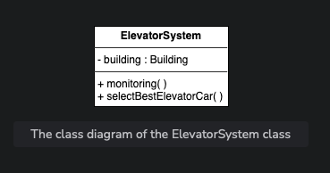

### Enumerations

Enumeration is generally a data type in which only a specific set of constants can be stored. Following is the list of enumerations required in the elevator system:

- ElevatorState: It describes the state of an elevator, which could be idle, up, or down.
- Direction: When the elevator is not in an idle state, it describes the direction of the motion of an elevator which could be up or down.
- DoorState: When the elevator is in an idle state, it describes the status of a door of an elevator that could be open or close.

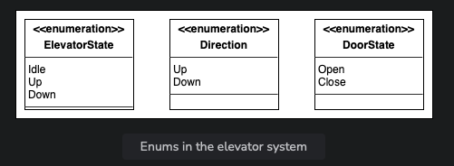

## Relationship between the classes

Now, we’ll discuss the relationships between the classes we have defined above in our elevator system.

### Aggregation

The class diagram has the following aggregation relationships:

- The ElevatorSystem has an aggregation relationship with Building.

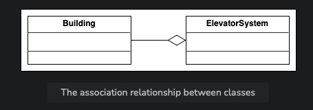

### Composition

The class diagram has the following composition relationships.

- The Building is composed of ElevatorCar and Floor.
- The ElevatorCar is composed of Door, ElevatorPanel, and Display.
- The Floor is composed of HallPanel and Display.
- The HallPanel is composed of the HallButton.
- The ElevatorPanel is composed of the ElevatorButton.

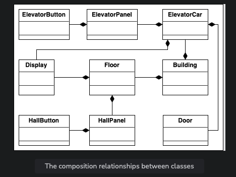
### Inheritance

The following classes show an inheritance relationship:

- Both ElevatorButton and HallButton extend the Button class.

> Note: We have already discussed the inheritance relationship between classes in the component section.

## Class diagram of the elevator system

Here’s the complete class diagram for our elevator system:

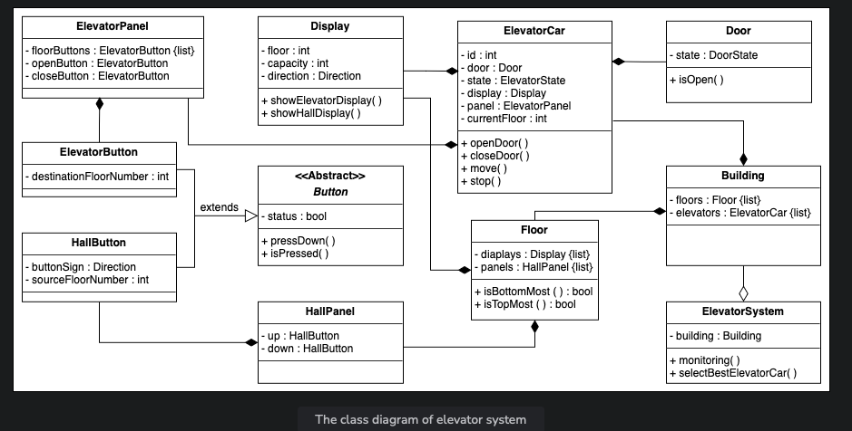

## Design pattern

The Strategy design pattern can be applied here since the system could have multiple dispatch request strategy classes. Therefore, depending on the particular layout of the building and its scenarios, we choose a set of dispatch request strategy classes.

We can also use the State and Delegation design pattern for this problem. Instead of implementing all methods on its own, the context object stores a reference to one of the state objects that represents its current state and delegates all the state-specific tasks to that object. For example, elevators have multiple states like working or idle, etc. Based on the state, the system infers which method or behavior of the elevator should be invoked.

## Additional requirements

The interviewer can introduce some additional requirements in the elevator control system, or they can ask some follow-up questions. The additional requirement can be about how the dispatcher works in the elevator system. The interviewer can ask to devise an algorithm to optimize any of these:

- To minimize the wait time of the system
- To minimize the wait time of the passenger
- To maximize throughput
- To minimize the power usage or cost

To optimize the elevator system, we have different dispatching algorithms.

### FCFS

First Come First Serve (FCFS) is a scheduling algorithm by which the passenger who comes first gets the elevator car and reaches the destination. There are four states of an elevator car with respect to the passenger:

1. The elevator car is in an idle state.
2. The elevator car is moving towards the passenger and in the same direction the passenger wants to go.
3. An elevator car is moving towards the passenger but in the opposite direction the passenger wants to go.
4. The elevator car is moving away from the passenger.

In this algorithm, the dispatcher will try to find elevators that are in either of the first two states and ignore those elevators which are in either of the last two states.

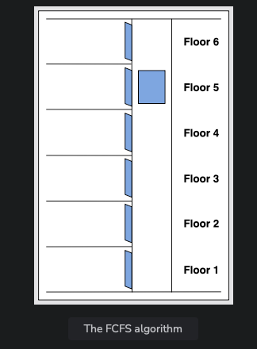 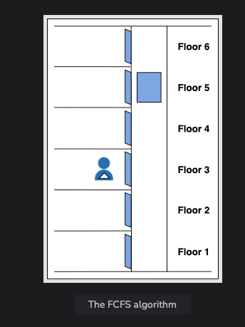 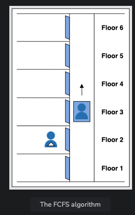 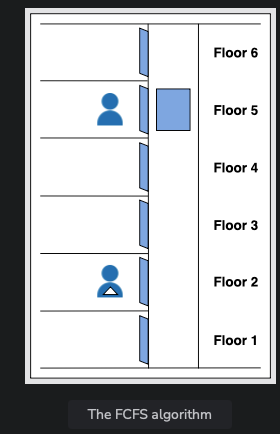 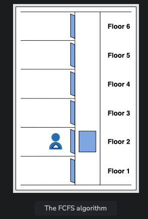 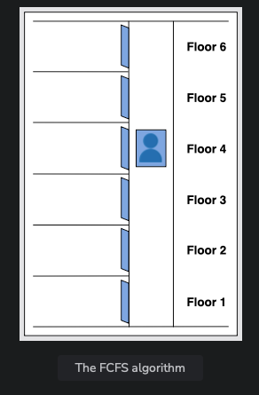 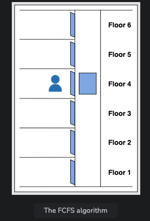

The advantage of this algorithm is that it is simple and easy to implement. The drawback of this algorithm is that extra elevator movements occur by this algorithm which results in more power usage and cost. To implement FCFS, we can use a queue data structure to keep track of which passenger comes first.

### SSTF

Shortest Seek Time First (SSTF) is an algorithm in which the passenger who is closest to the elevator car would get the elevator car. This algorithm is considered better than FCFS since less elevator movement is required as compared to the FCFS algorithm. This algorithm also results in an increased throughput. However, there is a loophole in this method where it always chooses the minimum distant passengers and ignore the farther ones completely. To implement this algorithm, we can use a priority queue, min-heap, or an array data structure.

### SCAN

SCAN is also known as the Elevator Algorithm. The elevator car starts from one end of the building and moves towards the other end, servicing requests in between. The advantage of this method is that it serves multiple requests in parallel. However, it results in increased cost as the elevator car only changes its direction at either the top floor, or the lowest floor. The implementation of SCAN can be done using two boolean arrays or a single HashMap, or two priority queues data structures to track the floor where the elevator should stop.

### LOOK

LOOK is also known as the look-ahead SCAN algorithm. It is an improved version of the SCAN Algorithm. In this algorithm, the elevator car stops when there is no request in front of them. It will move again on the basis of the request. The advantage of this algorithm is that the elevator car does not always go till the end of the building but can change its direction in between. This algorithm can be implemented using a HashMap, TreeMap, or binary search tree data structure.

We have completed the class diagram of the elevator system according to the requirements. Let’s design the sequence diagram of the elevator control system in the next lesson.
