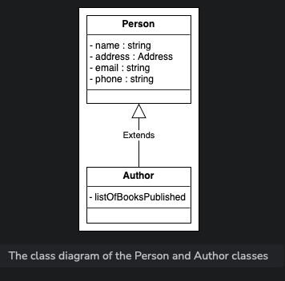

# Components of a Library Management System

In this section, we will define the classes for LMS. We will follow a bottom-up approach, starting with small components and integrating them into the class diagram for the whole library management system.

## Book and Book Item

The `Book` class stores complete information about a book such as ISBN, title, subject, etc. It includes a complex member `authors` representing a list of book authors. The `Book` class also includes an enum `BookFormat` for different book types.

The `BookItem` class extends `Book` and represents a single copy of the book. It contains details like price, rack information, etc. It uses an enum `BookStatus` to track the current status of the book.

## Rack

The `Rack` class identifies the physical location of book items in the library. Each rack has a specific rack number and location identifier.

)

## Person and Author

The `Person` class stores information about a person, including their name, email, phone number, etc. It contains an object of the `Address` class for the person's address.

The `Author` class stores author data like name and description.

## User, Librarian, and Library Member

The `User` class represents system users of LMS. There are two types: `Librarian` and `Library Member`. Both classes extend `User`.

## Library Card

The `LibraryCard` class manages each user's library card information, including ID, issue date, and activation status.

## Book Reservation

The `BookReservation` class manages book reservation status.

## Book Lending

The `BookLending` class manages the process of checking out book items, including lending date, due date, etc.

## Notification

The `Notification` abstract class sends notifications to library members. It has subclasses `PostalNotification` and `EmailNotification`.

## Search and Catalog

The `Search` interface allows users to search for books by title, author, subject, or publication date. The `Catalog` class implements this interface.

## Library

The `Library` class represents the library and contains its name and address.

## Enumerations

Enumerations include `BookFormat`, `BookStatus`, `ReservationStatus`, and `AccountStatus`.

## Custom Data Type

The `Address` class stores the address of the library and users.

## Relationships between the classes

- **Association**: 
  - One-way
    - The iuser has a one-way associaiton with BookItem and BookReservation
    - Both BookReservation and BookLending have a one-way association with the BookItem.
    - 
  - two-way associations between classes.
    - Author has a two-way association with Book.
    - Both Rack and Librarian have a two-way association with BookItem.
    - The Notification has a two-way association with BookLending and BookReservation.
    - The BookLending has a two-way association with BookReservation and User.
    - 
- **Composition**: 
  - `Library` composed of `BookItem` 
  -  `User` composed of `LibraryCard`.
  - 
- **Aggregation**: 
  - `Catalog` contains `Book`.
  - 
- **Inheritance**: 
  - `Librarian` and `Library Member` inherit from `User`.
  - Both EmailNotification and PostalNotification classes extend the Notification class.
  - The BookItem class extends the Book class.
  - The Catalog class implements the Search interface.
    
    
    
## Class Diagram of Library Management System

## Additional Requirements

Additional requirements may include a `BarcodeReader` and `FineTransaction`.

