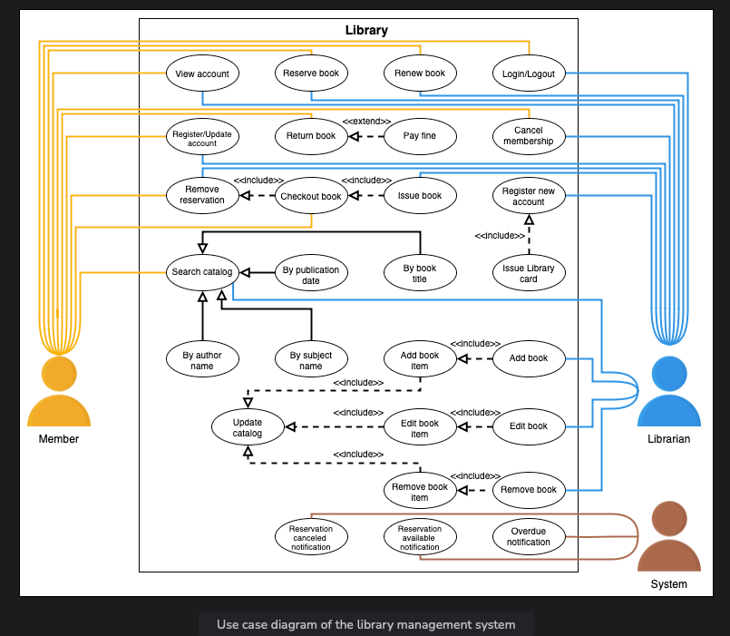

# Problem Definition

A library management system (LMS) aims to automate all library activities. It is a software that helps manage all the primary functions of library management. With the help of a library management system, we can organize, handle, and maintain the record of numerous books and the members in a comprehensive and systematic way.

A librarian can use this software to track the number of books in the library. They can also use it to retain several records including, the new books, borrowed books with due dates, the member who borrowed books, returned books, fine on the late returned books, etc. In short, the library management system stores and updates the complete library database.

LMS also supports maintaining the physical library. The user can keep track of the position of the book in the library and can search for whether or not the specific book is currently available in the library. Therefore, LMS helps organize and retrieve library data in an efficient manner.

## An Example of the Library Management System

# Expectations from the Interviewee

There are multiple components of the LMS, each with its own specific requirements and constraints. Let’s look at some of the main expectations that the interviewer will want to hear you discuss in more detail during the interview.

## Efficient Searching

Searching for books is one of the most crucial functions of LMS. The user must be able to search for any book. Different users may want to search for a book through different methods. Therefore, the interviewer can ask questions like these:

- Would the user be able to search for a book using attributes other than the book name?
- How will the user be able to search for a book by its author name, publication date, etc.?
- How will the user search a specific category of books like magazines, journals, newspapers, etc.?

## Versatility

Before designing the system, it is mandatory to specify the actors of the system. Hence, the interviewer can ask about the actors of the system as follows:

- Can the software only be used by a librarian or by all library members?

## Book Reservation

Another significant feature of LMS is the reservation of the book.

- What is the mechanism of book reservation?
- Can a member reserve a book again if it is already reserved?
- How does the status of the book change when a member returns a book?

## Book Renewal

Similar to the book reservation, the interviewer can ask about the book renewal functionality with a question like this:

- What is the mechanism of book renewal if a member wants to hold a book for a longer period of time?

## Fine Management

There is another question that the interviewer may be interested to ask:

- How is the calculation and deduction of fines handled if the book is returned late?

# Design Approach

We are going to design this library management system using the bottom-up design approach. For this purpose, we will follow the steps below:

1. Identify and design the smallest components first.
2. Use these small components to design bigger components.
3. Repeat the steps above until we design the whole system.

# Design Pattern

It is always a good practice to discuss the design patterns that an LMS falls under, during the interview. Stating the design patterns will give the interviewer a positive impression and shows that the interviewee is well-versed in the advanced concepts of object-oriented design.

The following design patterns can be used to design the library management system:

- Factory design pattern
- Delegation design pattern
- Observer design pattern

# Requirement Collection

For LMS (Library Management System), the requirements have been defined below:

### R1: Storing Information

The system should be able to store the information about books and members of the library. Moreover, the complete log of the book borrowing process should also be stored.

### R2: Book Identification

Every book is supposed to have a unique identification number and other details including a rack number to help locate the book physically.

### R3: Book Details

Every book should have an associated ISBN, title, author name, subject, and publication date.

### R4: Book Copies

There can be multiple copies of the book. Each copy will be recognized as a book item.

### R5: User Types

There can be two types of users, i.e., the librarian and the members.

### R6: Library Cards

Every user must have a library card with a unique card number.

### R7: Book Issuance Limit

One member can issue a maximum of 10 books at a time.

### R8: Book Issuance Duration

The member can issue a book for a maximum of 15 days.

### R9: Book Reservation Limit

Each book item can only be reserved by a single member.

### R10: Record Keeping

The system should be able to keep a record of who issued or reserved a particular book and on which date.

### R11: Book Renewal

The system should allow the user to renew the reserved book.

### R12: Notification

The system should send a notification if the book is not returned within the due date.

### R13: Book Reservation

If the book is currently not available, then the member should be able to reserve it for whenever it is available.

### R14: Book Searching

The system should allow the user to search a book by its title, author name, subject, or publication date.

# Use Case Diagram: Library Management System

## System Overview

Our system is a "library."

## Actors

### Primary Actors

- **Member**: This actor is the client of the library. It can search, reserve, renew, or return a book and modify its library membership.
- **Librarian**: Acts as an admin in a library management system. It can add or remove a book, modify the status of members or books, issue and return books.

### Secondary Actors

- **System**: Sends alerts related to reservations and late returns of books.

## Use Cases

### Librarian

- **Add book**: Add a new book to the library.
- **Remove book**: Remove an existing book from the library.
- **Edit book**: Modify book details.
- **Register new account**: Register a new library member.
- **Cancel membership**: Cancel the library membership of a member.
- **Register/Update account**: Create or update an account.
- **Login/Logout**: Log in or log out of the account.
- **Issue book**: Issue a book to a member.
- **Remove reservation**: Remove reservation of books.
- **Renew book**: Renew the issuance of the book.
- **Reserve book**: Reserve a book that is currently not available.
- **View account**: View the account and access all account details.

### Member

- **Search catalog**: Search for a book in the library.
- **Cancel membership**: Cancel the library membership of a member.
- **Register/Update account**: Create or update an account.
- **Login/Logout**: Log in or log out of the account.
- **Checkout book**: Complete the issue book process.
- **Remove reservation**: Remove the reservation of books.
- **Renew book**: Renew the issuance of the book.
- **Reserve book**: Reserve a book that is currently not available.
- **View account**: View the account and access all account details.
- **Return book**: Return a book to the library.

### System

- **Overdue notification**: Send an alert if the book is not returned on time.
- **Reservation available notification**: Send an alert when the book is available for reservation.
- **Reservation canceled notification**: Send an alert when a book reservation is canceled.

### Shared Use Cases

- **Add book item**: Add an item of a book in the catalog.
- **Edit book item**: Edit the details of a book item in the catalog.
- **Remove book item**: Remove a book item from the catalog.
- **Update catalog**: Update (add, edit, or remove) a book item or book from the catalog.
- **Issue library card**: Issue a library card to new members for identification.
- **By subject name**: Search for a book in the catalog by its subject name.
- **By book title**: Search for a book in the catalog by its title.
- **By author name**: Search for a book in the catalog by its author name.
- **By publication date**: Search for a book in the catalog by its publication date.
- **Pay fine**: Pay a fine if the book is returned after the due date.

## Relationships

### Generalization

- **Search catalog** generalizes **By subject name**, **By book title**, **By author name**, and **By publication date**.

### Associations

The table below shows the association relationship between actors and their use cases.

| Librarian            | Member               | System                  |
|----------------------|----------------------|-------------------------|
| Add book             | Search catalog       | Overdue notification    |
| Remove book          | Cancel membership    | Reservation available notification |
| Edit book            | Register/Update account | Reservation canceled notification |
| Register new account| Login/Logout         |                          |
| Cancel membership    | Checkout book        |                          |
| Register/Update account | Remove reservation |                          |
| Login/Logout         | Renew book           |                          |
| Issue book           | Issue book           |                          |
| Remove reservation   | Reserve book         |                          |
| Renew book           | Remove reservation   |                          |
| View account         | View account         |                          |

### Include

- **Add book** includes **Add book item**.
- **Edit book** includes **Edit book item**.
- **Remove book** includes **Remove book item**.
- **Update catalog** includes **Add book item**, **Edit book item**, and **Remove book item**.
- **Issue book** includes **Checkout book**.
- **Checkout book** includes **Remove reservation**.

### Extend

- **Register new member** extends **Issue library card**.
- **Return book** extends **Pay fine**.

## Use Case Diagram

