# Components of a Parking Lot System

As mentioned earlier, we should design the parking lot system using a bottom-up approach. Therefore, we will first identify and design the classes of the smaller components like vehicles and parking spots. Then, we will create the class of the entire parking lot system, including these smaller components.

## Vehicle
Our parking lot system should have a vehicle object according to the requirements. The vehicle can be a car, a truck, a van, and a motorcycle. There are two ways to represent a vehicle in our system:

- Enumeration
- Abstract class

### Enumeration vs. Abstract class
The enumeration class creates a user-defined data type that has the four vehicle types as values.

This approach is not proficient for object-oriented design because if we want to add one more vehicle type later in our system, then we would need to update the code in multiple places in our code, and this would violate the Open Closed principle of the SOLID design principle. This is because the Open Closed principle states that classes can be extended but not modified. Therefore, it is recommended not to use the enumeration data type as it is not a scalable approach.

Note: Using enums isn’t prohibited, but just not recommended. Later, we will use the PaymentStatus enum in our parking lot design as it won’t require further modifications.

An abstract class cannot instantiate the object and can only be used as a base class. The abstract class for Vehicle is the best approach. It allows us to create derived child classes for the Vehicle class. It can be extended easily in case the vehicle type changes in the future.

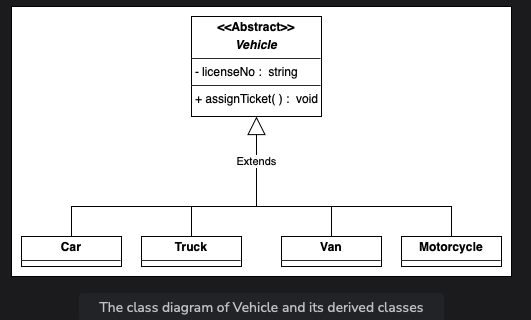
## Parking Spot
Similar to the Vehicle class, the ParkingSpot should also be an abstract class. There are four types of parking spots: handicapped, compact, large, and motorcycle. These classes can be derived from the parking spot abstract class.

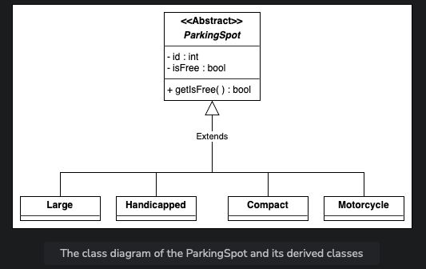
## Account
Similar to the Vehicle and ParkingSpot classes, Account should also be an abstract class. There are two child classes: Admin and ParkingAgent. These classes can be derived from the account abstract class.

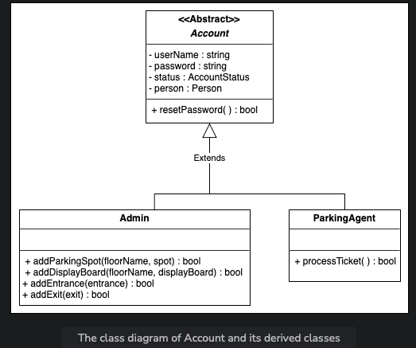
## Display Board
This class represents the free parking spot types and the number of empty slots.

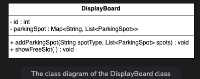
## Entrance and Exit
The Entrance class is responsible for returning the parking ticket whenever a vehicle arrives. It contains the ID attribute, since there are multiple entrances to the parking lot. It also has the getTicket() method.

The Exit class is responsible for validating the parking ticket’s payment status before allowing the vehicle to exit the parking lot. It contains the ID attribute, since there are multiple exits to the parking lot. It also has the validateTicket() method.

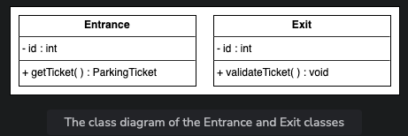
## Parking Ticket
The ParkingTicket class is one of the central classes of the system. It keeps track of the entrance and exit times of the vehicles, the amount, and the payment status.

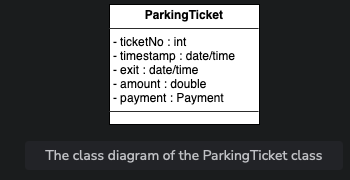
## Payment
The Payment class will be an abstract class and will have two child classes, card and cash, since these are two payment methods of the parking lot system.

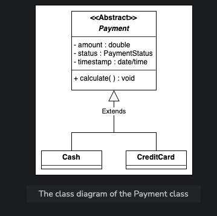
## Parking Rate
The ParkingRate class is responsible for calculating the final payment based on the time spent in the parking lot.

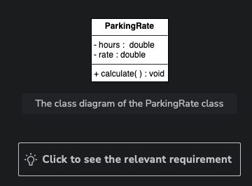
## Parking Lot
Now, we will discuss the design of the whole ParkingLot system class. This parking lot system is composed of smaller objects we have already designed, like entrance/exit, parking spots, parking rates, etc.

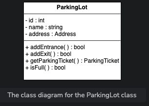
## The Enumerations and Custom Data Types

### PaymentStatus
We need to create an enumeration to keep track of the payment status of the parking ticket, whether it is paid, unpaid, canceled, refunded, and so on.

### AccountStatus
We need to create an enumeration to keep track of the status of the account, whether it is active, canceled, closed, and so on.

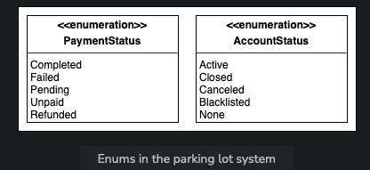
### Address
We also need to create a custom data type, Address, that will store the location of the parking lot.

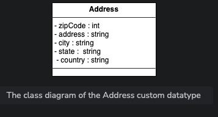
### Person
The Person class is used to store information related to a person like a name, street address, country, etc.

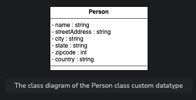
## Relationship between the Classes
Now, we’ll discuss the relationships between the classes we have defined above in our parking lot system.

### Association
The ParkingSpot has a one-way association with Vehicle.
The Vehicle has a one-way association with ParkingTicket.
The Payment has a two-way association with ParkingTicket.

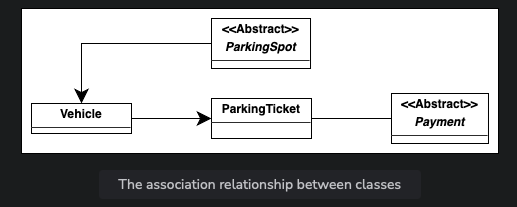
### Composition
The ParkingLot class includes Entrance, Exit, ParkingRate, DisplayBoard, ParkingTicket, and ParkingSpot.

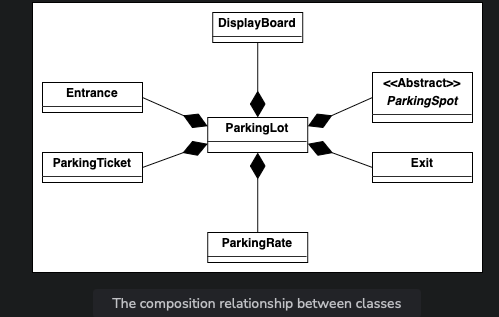
### Inheritance
The Vehicle class includes Car, Truck, Van, and MotorCycle subclasses.
The ParkingSpot class includes handicapped, compact, large, and motorcycle subclasses.
The Payment class includes the Cash and CreditCard subclasses.

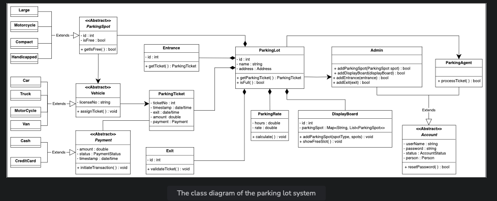
## Design Pattern
The system itself will have a ParkingLot class. It will use the Singleton design pattern, because there will only be a single instance of the parking lot system.

This parking lot system is also composed of smaller objects that we have already designed, like entrance, exit, parking spots, parking rates, etc. Therefore, it will be a good practice to use the Abstract Factory and Factory design pattern to instantiate all those objects.

## Additional Requirements
The interviewer can introduce some additional requirements in the parking lot system, or they can ask some follow-up questions. Let’s see some examples of additional requirements:

### Parking Floor
The parking lot should have multiple floors where customers can park their cars. The class diagram provided below shows the relationship of ParkingFloor with other classes.

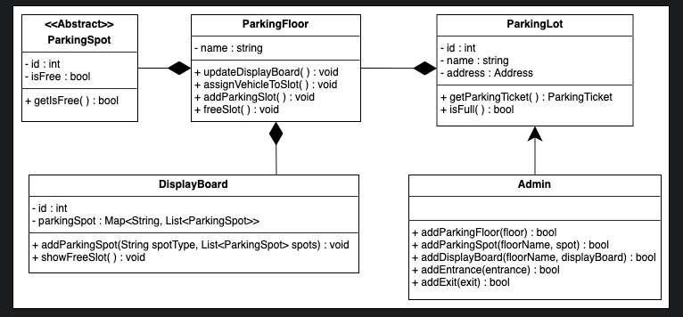
### Electric
The parking lot should have some parking spots specified for electric cars. These spots should have an electric panel through which customers can pay and charge their vehicles. The class diagram provided below shows the relationship of Electric and ElectricPanel with other classes.

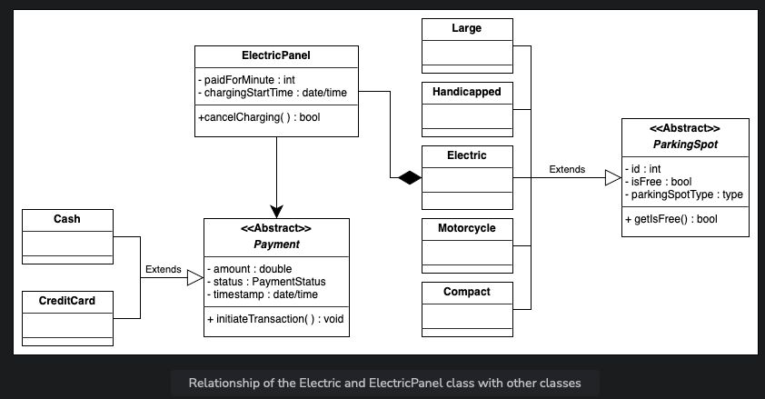