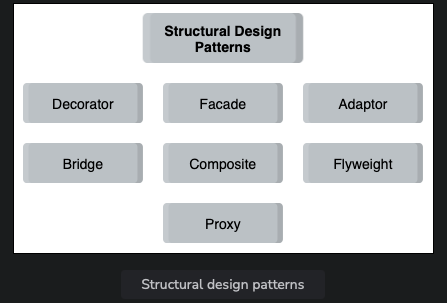
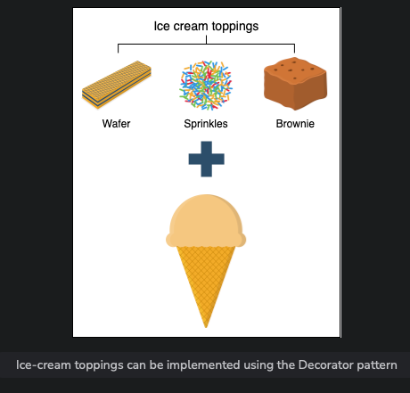
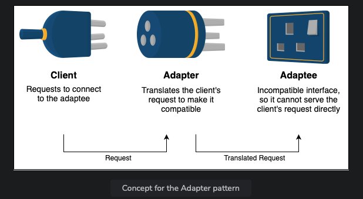
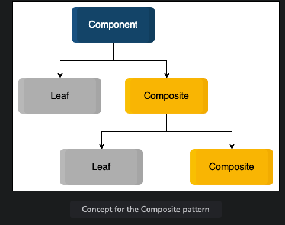
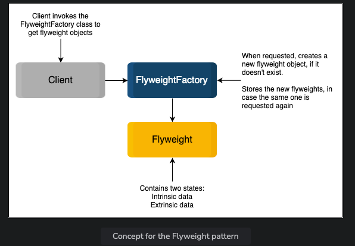

# Introduction to Structural Patterns

In this lesson, we will discuss structural design patterns. As the name implies, these patterns are concerned with object relationships and the structure of classes or objects. They help to add new functionality without having to modify the entire system. They ensure that if one part of a system changes, the whole system does not change with it. Let’s look at the most common structural patterns that are used in solving design problems.

## Structural Design Patterns

### Decorator Pattern

The Decorator pattern focuses on adding properties, functionalities, and behavior to existing classes dynamically. The additional decoration functionalities aren’t considered essential enough to be a part of the original class definition since they can cause clutter. Hence, the Decorator pattern lets us modify the code without changing the original class.

### Facade Pattern

The Facade pattern provides a simpler interface that hides the complex functionalities of a system. It allows us to hide all the messy logic from the client and only display the clear and easy-to-use interface to them. This simplifies the interaction for the client, making it less error-prone and without accessing the inner workings directly.

### Adapter Pattern

The Adapter pattern allows classes with different interfaces to work together by translating the interface for a class to make it compatible with another class. It is useful when an API is modified or new implementations are added to it, ensuring compatibility between different parts of the system.

### Bridge Pattern

The Bridge pattern allows separate components with separate interfaces to work together by keeping an object’s interface separate from its implementation. This allows the two to vary independently, enabling flexibility and scalability in the system.

### Composite Pattern

The Composite pattern is used to structure objects in a tree-like hierarchy, where each node of the tree can be composed of either child node(s) or be a leaf (no children objects). It allows the client to work with these components uniformly, treating a single object exactly like a group of objects.

### Flyweight Pattern

The Flyweight pattern focuses on how related objects share data, preventing repetitive code and conserving memory. It takes common data structures/objects used by many objects and stores them in an external object (flyweight) for sharing, improving efficiency and memory usage.

### Proxy Pattern

The Proxy pattern creates a placeholder object that controls access to another object, dividing the load with the target object. It helps in situations where an object might not be able to handle clients’ requests alone due to heavy load or constraints, providing a proxy to handle requests and forward them to the target object.

## When to Use Structural Patterns

| Structural Design Pattern | When to Use |
|---------------------------|-------------|
| Decorator                 | - To modify or extend the functionality of an object without changing its base code. - To implement additional functionalities of similar objects instead of reusing the same code. |
| Facade                    | - To simplify a client’s interaction with a system by hiding the underlying complex code. - To interact with the methods present in a library without knowing the processing that happens in the background. |
| Adapter                   | - To enable old APIs to work with new refactored ones. - To allow an object to cooperate with a class that has an incompatible interface. - To reuse the existing functionality of classes. |
| Bridge                    | - To extend a class in several independent dimensions. - To change the implementation at run time. - To share the implementation between objects. |
| Composite                 | - To allow the reuse of objects without worrying about their compatibility. - To develop a scalable application that uses plenty of objects. - To create a tree-like hierarchy of objects. |
| Flyweight                 | - To share a list of immutable strings across the application. - To prevent load time as it allows caching. |
| Proxy                     | - To reduce the workload on the target object. |
