# Vending Machine Overview

A vending machine is an automated machine that provides items such as snacks, chocolates, and beverages to consumers. It contains multiple racks with products, and users can insert money, select a product from a specific rack, and press a button to purchase the item. The vending machine dispenses the chosen product based on the amount of money inserted.

Modern vending machines originated in England in the early 1880s, initially dispensing postcards. Today, there are specialized vending machines catering to specific products. Operating 24/7, these standalone units require a standard power supply connection and utilize electromechanical systems to automate the vending process, ensuring seamless product delivery to users.

The process of product purchasing using a vending machine can be summarized as follows:

1. **Step 1**: Insert cash according to the price of the desired product.

## Expectations from the Interviewee

While the vending machine design problem is relatively simple, interviewers typically have specific expectations regarding the discussion. Key points they may want to hear include:

### States of the Vending Machine

Interviewers may expect discussion on the different states of the vending machine, including:

- Functions performed by vending machines and the potential number of states they can have.
- Actions taken by the system after money insertion.
- User interaction with the vending machine button and subsequent actions.
- Functionality of the dispense operation.
- Possibility of inserting money while the vending machine is in a dispense state.
- Ability to select a product without paying money while in the NoMoneyInsertedState.

### Money Handling

Interviewers may inquire about the handling of money within the vending machine system, including:

- Actions taken if the amount paid is less than the product price.
- Handling of excess payment compared to the product price.
- Possibility of using credit cards for payment versus cash-only transactions.

### Design Approach

A bottom-up design approach is typically employed in solving the vending machine problem. This involves:

1. Identifying and designing small components, such as individual products.
2. Utilizing these components to design larger entities like the inventory.
3. Iterating through the above steps until the entire vending machine system is designed.

### Design Patterns

Discussing relevant design patterns during the interview demonstrates proficiency in advanced object-oriented design concepts. The vending machine commonly falls under the following design patterns:

- State design pattern
- Singleton design pattern

# Requirement Collection

The requirements for the vending machine problem are defined below:

## R1: Product Placement

- There are different products placed at different positions in the vending machine.

## R2: Vending Machine States

- The vending machine can be in one of these three states:
    - **NoMoneyInsertedState**: There is no money inserted into the machine.
    - **MoneyInsertedState**: Money is inserted into the machine.
    - **DispenseState**: The machine gives out the product.

## R3: System Actors

- There can be two actors in the system:
    - One is the user.
    - The other is the admin.

## R4: Admin Functionality

- The admin can add a product to the machine or remove a product from the machine.

## R5: Product Selection

- The system should allow the users to select a product they want to purchase from the machine by specifying the rack number.

## R6: Money Insertion

- The user can insert money into the machine in the form of cash.

## R7: Money Calculation

- The system should be able to calculate the money inserted into the machine.

## R8: Amount Verification

- The system should check whether the user inserted the exact amount required for the specific product into the machine.

## R9: Excess Payment Handling

- If the amount is greater than the product price, the system should change back the user and dispense the product.

## R10: Insufficient Payment Handling

- If the amount is less than the product price, the system should display an error message and return the money.

We've identified our requirements for the problem, and in the next lesson, we will define the class diagram of our vending machine system.

# Components of a Vending Machine

As mentioned earlier, we should design the vending machine using a bottom-up approach.

## State

State is an interface that represents the current state of the vending machine. There can be three possible states of a vending machine:

- **NoMoneyInsertedState**: There is no money inserted into the machine.
- **MoneyInsertedState**: Money is inserted into the machine.
- **DispenseState**: The machine gives out the product.

This problem follows the State design pattern since the vending machine changes its behavior based on its state.

### Class Diagram of the State Interface and Its Subclasses

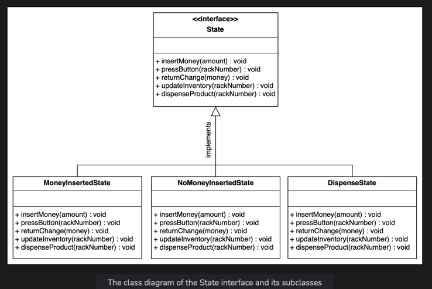

Product
The Product class contains the details of a particular product available in the vending machine. Each product has name, id, price, and its type associated with it.

### Class Diagram of the Product Class

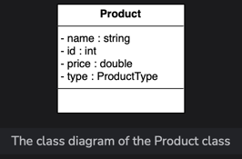

Rack
The Rack class is used to identify the location of the product in the vending machine. Every rack has a specific rackNumber as an identifier.

### Class Diagram of the Rack Class

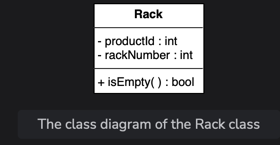

Inventory
The Inventory class will contain a list of products available at different positions inside the vending machine. It will also reference the name of the product present in the particular rack. This class is also responsible for adding a product to the vending machine.

### Class Diagram of the Inventory Class

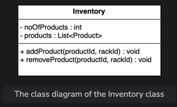

Vending Machine
VendingMachine is a class that represents the whole vending machine. The State type variable is used to define the current state of the vending machine. The vending machine has a list of racks and amount stored in it. This class follows the Singleton design pattern, since there will only be one instance of the class.

### Class Diagram of the VendingMachine Class

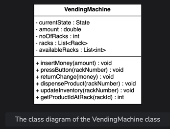

Enumeration
The enumeration required to design the vending machine system is provided below:

### ProductType Enumeration

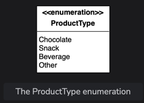

Relationship Between the Classes

Composition
The class diagram has the following composition relationships:

- The VendingMachine class is composed of the Rack class.
- The Inventory class is composed of the Product class.

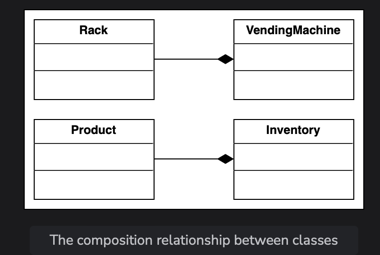

Aggregation
The class diagram has the following aggregation relationships:

- The VendingMachine class contains the State interface.

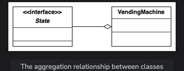

Association
The class diagram has the following association relationships.

- The VendingMachine class has a two-way association with the Inventory class.
- The Rack class has a two-way association with the Product class.

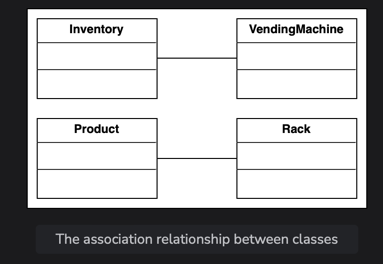

Inheritance
The following classes show an inheritance relationship:

- The NoMoneyInsertedState, MoneyInsertedState, and DispenseState classes implement the State interface.

Class Diagram for the Vending Machine

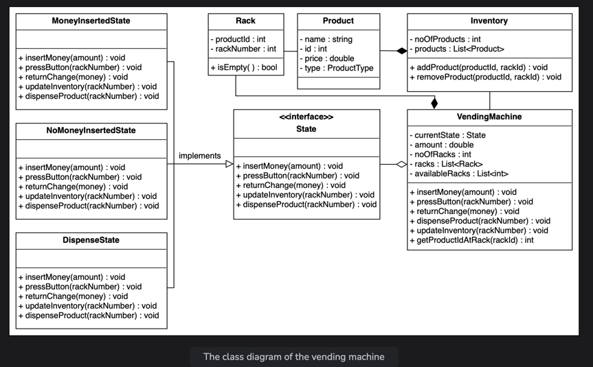

Design Pattern
We have used the State design pattern to design this problem because, in different states, we perform different or specific tasks according to the state. The vending machine changes its behavior based on its state. The different states within the system are listed below:

- No money inserted state
- Money inserted state
- Dispense state

All these states have the same methods but the implementation of each method in each state changes with the change of the state.

Additional Requirements
The interviewer can introduce some additional requirements in the vending machine, or they can ask some follow-up questions. Let's see some examples of additional requirements:

Refund/Cancel: The vending machine should have the option to cancel the operation. In that case, the customers will get a refund. The class diagram provided below shows the refund functionality in all states:

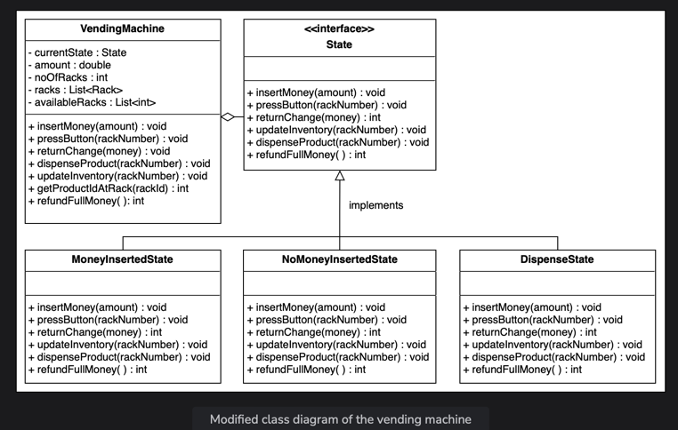

In the class diagram above, we can see a function, refundFullMoney(), in all states which is used to refund the full money. Here is the definition of the refundFullMoney() function according to each state:

- **NoMoneyInsertedState**: In this state, the refundFullMoney() function throws an exception or warning, “please insert some cash first” because we we have not inserted any money yet.
- **MoneyInsertedState**: In this state, we know the customer inserted the cash because, due to this, we shifted the state of the vending machine from NoMoneyInsertedState to MoneyInsertedState. If the customer uses the refund option, then the refundFullMoney() function will call and return the full amount back in the change tray.
- **DispenseState**: In this state, the refundFullMoney() function is blocked. We can say that if the customer uses the refund option, then the system does not do anything. This is because, in this state, the customer has already selected a product, and the vending machine is in the dispense state.
